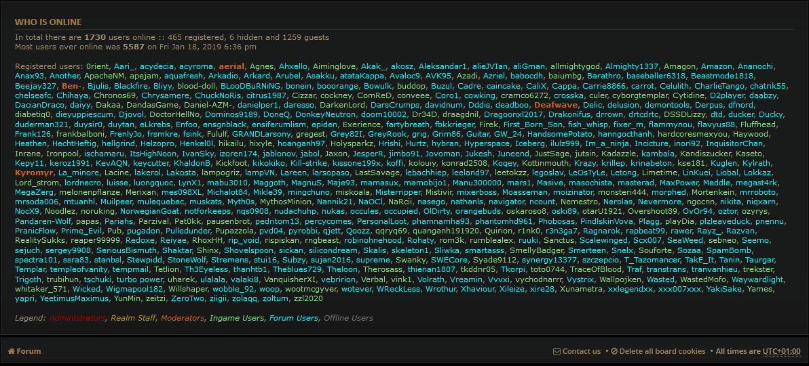
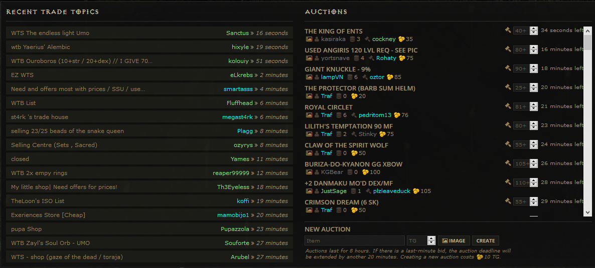
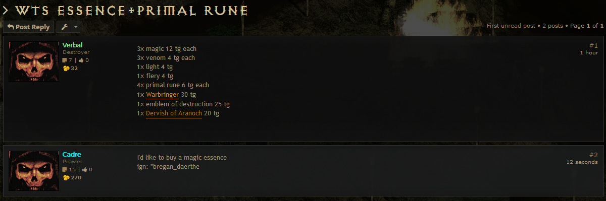

# Greasemonkey QoL extension for median xl forum

Add more username status colors on median XL forum (online, ingame, offline), more features to come...

# Screenshots

# Download

# Installation steps

## Desktop
- Install Greasemonkey/tampermonkey extension ([chrome addon](https://tampermonkey.net/), [firefox addon](https://addons.mozilla.org/en-US/firefox/addon/greasemonkey))
- Import the downloaded archive from the greasemonkey menu (restore backup)
- Done

## Mobile
- Install Greasemonkey extension (only available on firefox mobile, chrome mobile does not allows to install extensions)
- Download/Upload the archive on your phone (browser/USB/share/etc.)
- Import the downloaded archive from the greasemonkey menu (restore backup)
- Done

# More informations

## Customization
Very simple script with easily modifiable variables (colors, timing, etc...).

## Performance
A cache is implemented with localstorage to only request the user lists every 30 seconds by default when you navigate (cache expiration time).

## Why is greasemonkey needed ?

Greasemonkey allows to bypass cross-domain ajax protection, so we can query the two users list (forum/ingame) pages that are on two separate subdomains ([https://forum.median-xl.com](https://forum.median-xl.com) and [https://tsw.median-xl.com/info](https://tsw.median-xl.com/info)).
